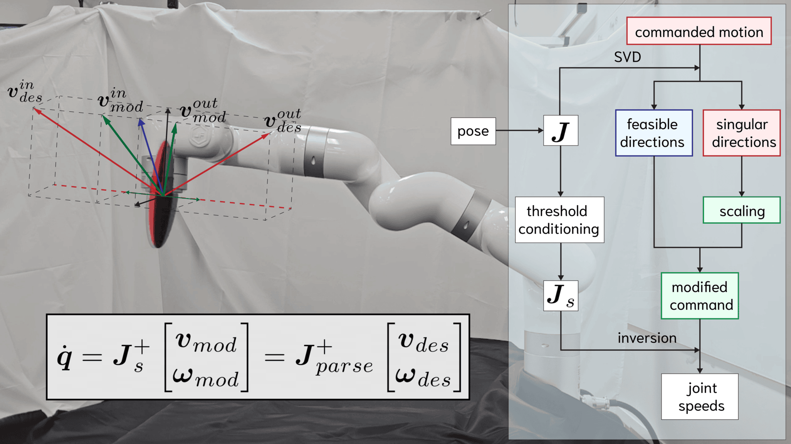
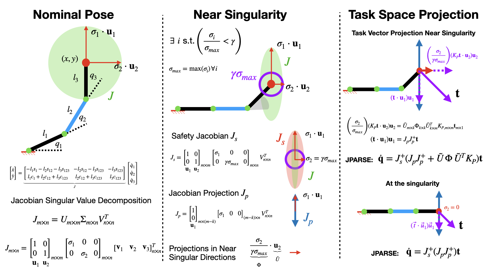

# 🦾 J-PARSE: Jacobian-based Projection Algorithm for Resolving Singularities Effectively in Inverse Kinematic Control of Serial Manipulators

### [Shivani Guptasarma](https://www.linkedin.com/in/shivani-guptasarma/), [Matthew Strong](https://peasant98.github.io/), [Honghao Zhen](https://www.linkedin.com/in/honghao-zhen/), and [Monroe Kennedy III](https://monroekennedy3.com/)


_In Submission_



<!-- 
 -->

[](https://jparse-manip.github.io)
[](https://arxiv.org/abs/2505.00306) 

## ROS 2 DEV!!!
The `main` branch is supporting *ROS Noetic*.
The `ros2_dev` branch is developing the support for *ROS 2 Jazzy* (coming soon).

## FOR ARGALLAB (ROS 2)
Instructions to teleop robot with jparse and keyboard:
TODO: NEEDS TO BE TESTED and jparse_cls.py needs to be written!

Launch the following:
```
ros2 launch xarm_moveit_config xarm7_moveit_realmove.launch.py robot_ip:=<add the robot ip> add_gripper:=true

ros2 launch manipulator_control xarm_main_vel.launch use_teleop_control:=true use_teleop_control_jparse:=true

ros2 run teleop_twist_keyboard teleop_twist_keyboard stamped:=True frame_id:=link_eef --ros-args --remap cmd_vel:=robot_action
```

Edits need to be still commpleted to test the robot after writing script for joystick and sip/puff teleop.

## FOR ARGALLAB TO DOS (not in order of to do):
- [x] Need to implement gripper in the `xarm_vel_experimenter.py` -- this is a function call to the api!!! the topic is `/gripper_action`
- [ ] self-avoidance collision -- waiting for ros 2 port
- [ ] work-around for the joint limits so that the robot does *not* immediately need to be power cycled -- waiting for ros 2 port
- [ ] port to ros2 (need pinnochio) -- WORKING ON!!


### Instructions for Argallab
We will need to build the docker image ourself (but I guess sincewe now have it done once, need to remind myself to upload to argallab docker hub).
Below are the instructions for building the image ourself and the docker container:
```sh
cd <naviagte to your git clone of this>/Docker
docker build -t jparse .

sudo docker run -it --privileged \
-v /dev:/dev \
-v /home/demiana/workspaces/jparse_ws/src:/home/jparse_ws/src \
-e DISPLAY \
-e QT_X11_NO_MITSHM=1 \
--name argallab_jparse \
--net=host \
jparse:latest
```

This will start create the container as well. For future, to start the container:
```
sudo docker start -i argallab_jparse
```

If display is having issues, then in the local machine (outside docker) enter the following command:
```
xhost +local:docker 
```
